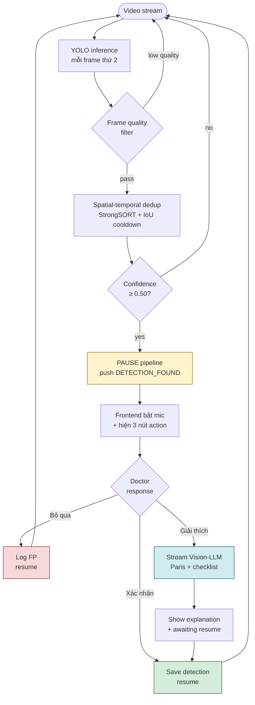
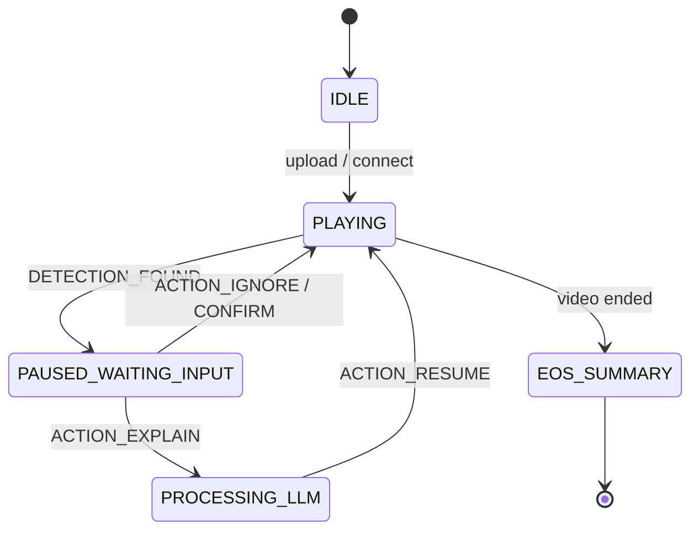

<div align="center">

<br/>

# AI Endoscopy Suite

### *Hệ thống Phân tích Nội soi AI Thời gian thực*

**Real-time GI endoscopy · Vietnamese voice control · Streaming Vision-LLM · Clinical reporting**

<br/>

[](https://github.com/nanhbui/Endoscopy-AI)
[](https://www.python.org/)
[](https://nextjs.org/)
[](https://fastapi.tiangolo.com/)
[](https://developer.nvidia.com/cuda-toolkit)
[](LICENSE)

<br/>

<sub>YOLOv8 lesion detection · Web Speech API + faster-whisper STT · MedGemma + Qwen2.5 (Ollama) · RAG-grounded reports · GStreamer pipeline · WebSocket realtime</sub>

<br/>

[**Getting Started**](#7-cài-đặt-nhanh) · [**Architecture**](#2-kiến-trúc-hệ-thống) · [**API**](#10-rest--websocket-api) · [**Voice**](#11-voice-control) · [**LLM**](#12-llm-backend-openai-vs-ollama) · [**Deploy**](#16-triển-khai-docker--gpu-server--vpn)

</div>

---

## Mục lục

<table>
<tr>
<td valign="top" width="33%">

**Bắt đầu**
1. [Tổng quan](#1-tổng-quan)
2. [Kiến trúc](#2-kiến-trúc-hệ-thống)
3. [Tính năng](#3-tính-năng-nổi-bật)
4. [Cấu trúc](#4-cấu-trúc-thư-mục)
5. [Tech stack](#5-tech-stack)
6. [Yêu cầu](#6-yêu-cầu-hệ-thống)

</td>
<td valign="top" width="33%">

**Vận hành**

7. [Cài đặt](#7-cài-đặt-nhanh)
8. [Chạy](#8-chạy-hệ-thống)
9. [Cấu hình](#9-cấu-hình--biến-môi-trường)
10. [API](#10-rest--websocket-api)
11. [Voice](#11-voice-control)
12. [LLM](#12-llm-backend-openai-vs-ollama)

</td>
<td valign="top" width="33%">

**Mở rộng**

13. [Roadmap](#13-phases--roadmap)
14. [Spec-driven](#14-spec-driven-development)
15. [Training](#15-training--dataset)
16. [Deploy](#16-triển-khai-docker--gpu-server--vpn)
17. [Dev & test](#17-phát-triển--test)
18. [Troubleshooting](#18-troubleshooting)
19. [Docs](#19-tài-liệu-thêm)

</td>
</tr>
</table>

---

## 1. Tổng quan

**AI Endoscopy Suite** là hệ thống hỗ trợ bác sĩ nội soi tiêu hoá ra quyết định lâm sàng, được thiết kế đặc biệt cho luồng làm việc **hands-free** trong phòng thủ thuật. Hệ thống nhận video nội soi (file MP4/MOV/AVI/MKV hoặc luồng RTSP/V4L2 trực tiếp), phát hiện tổn thương niêm mạc thời gian thực, tạm dừng tự động khi có nghi ngờ, và tương tác với bác sĩ qua **giọng nói tiếng Việt** + **Vision-LLM streaming**.

### Quy trình một detection điển hình



Khi hết video: hệ thống tự sinh **session summary** + đầy đủ detection cards + cho phép **chatbot Q&A** dựa trên session đó và **export PDF báo cáo**.

---

## 2. Kiến trúc hệ thống

```mermaid
flowchart TB
    subgraph FE["Next.js 16 Frontend · :3000"]
        direction LR
        FE1[Dashboard]
        FE2[Workspace<br/>video + bbox + voice]
        FE3[Báo cáo]
        FE4[Thống kê]
        FE5[AI Health Badge]
        FE6[Q&A Chatbot]
        FE7[Export PDF]
    end

    subgraph BE["FastAPI Backend · :8001"]
        direction TB
        BE1[Session registry<br/>+ upload + RTSP/V4L2]
        BE2[Video library<br/>reuse uploaded videos]
        BE3[LLM client factory<br/>OpenAI ⇄ Ollama]
        BE4[Web Speech API / faster-whisper STT<br/>+ Intent classifier]
        BE5[PDF export (browser print)<br/>+ Analytics]
        BE6[(SQLite<br/>lesion_reports · summaries · Q&A · kb_chunks)]
    end

    subgraph PIPE["GStreamer Subprocess · isolated GIL + CUDA"]
        direction TB
        P1[filesrc / rtspsrc / v4l2src]
        P2[avdec_h264 → videoconvert]
        P3[appsink → YOLO inference]
        P4[Frame Quality Filter]
        P5[StrongSORT ReID tracker<br/>spatial-temporal IoU dedup]
        P6([Detection events])
        P1 --> P2 --> P3 --> P4 --> P5 --> P6
    end

    FE <-->|"WebSocket /ws/analysis/{id}<br/>JSON events"| BE
    FE -->|"REST /upload /library /analytics<br/>/session/* /pipeline/*"| BE
    BE -->|"multiprocessing.spawn"| PIPE
    P6 -.->|"IPC events"| BE

    style FE fill:#e3f2fd,stroke:#1565c0,stroke-width:2px
    style BE fill:#fff3e0,stroke:#e65100,stroke-width:2px
    style PIPE fill:#f3e5f5,stroke:#6a1b9a,stroke-width:2px
    style BE6 fill:#fff,stroke:#666,stroke-dasharray: 5 5
```

> **Vì sao chạy subprocess?** GStreamer (GLib-thread) và YOLO (CUDA) kết hợp với uvloop của FastAPI hay deadlock. Cô lập trong subprocess bằng `multiprocessing.spawn` triệt để được vấn đề này và cho phép restart pipeline mà không kill server.

### Lưu trữ (SQLite)

> Sessions là **virtual** (aggregated by `session_id`) — không có bảng vật lý. Video library là **JSON index file**, không phải bảng DB.

| Bảng | Mục đích |
|---|---|
| `lesion_reports` | detection events đã được bác sĩ xác nhận hoặc auto-saved |
| `session_summaries` | tổng kết tự sinh sau khi video kết thúc |
| `qa_messages` | lịch sử chatbot Q&A theo session |
| `patient_context` | thông tin bệnh nhân (PHI tuỳ chọn) mỗi session |
| `false_positives` | events bị `BO_QUA` — dùng cho analytics + retraining |
| `confirmed_lesions` | bộ nhớ cross-session "confirm-always" — auto-capture khi track tái xuất hiện |
| `kb_chunks` | corpus guideline RAG (Paris / Sydney / Kyoto / ESGE / biopsy) — bge-m3 embeddings |

---

## 3. Tính năng nổi bật

<table>
<tr>
<td width="50%" valign="top">

### Detection Pipeline
- **Real-time YOLO** — inference mỗi 2nd frame, conf ≥ 0.50 (cancer 0.75, viêm/loét 0.60)
- **Frame quality filter** — bỏ qua frame chèn ống, frame tối, bảng thông tin
- **StrongSORT + OSNet ReID** — tracker qua boxmot, spatial-temporal IoU dedup, không re-flag cùng lesion
- **Browser-capture live mode** — HDMI dongle qua getUserMedia → JPEG frames → `/ws/live-detect/{id}` ~5fps
- **Pipeline introspection** — `/pipeline/metrics` + `/pipeline/graph`
- **Live stream** — RTSP / V4L2 ngoài file upload

### Voice & Interaction
- **Hands-free** — Web Speech API vi-VN (on-device, primary) + faster-whisper server-side (fallback)
- **4 intents** — `BO_QUA` / `GIAI_THICH` / `XAC_NHAN` / `KIEM_TRA_LAI`
- **3 detection actions** — quick-confirm / recheck / report-FP
- **Touch + voice parity** — một chạm hoặc một câu nói

</td>
<td width="50%" valign="top">

### LLM & Reporting
- **Streaming Vision-LLM** — MedGemma-4b (vision, per-lesion report + session summary), từng token
- **RAG-grounded reports** — bge-m3 embeddings, 5 guideline chunks (Paris/Sydney/Kyoto/ESGE/biopsy) từ SQLite `kb_chunks`, cosine retrieval, evidence trích dẫn tự động
- **Paris classification + checklist** — định dạng lâm sàng chuẩn
- **Session summary** — auto sau khi video kết thúc
- **Q&A chatbot** — Qwen2.5:7b-instruct, hỏi đáp ngữ cảnh session
- **Export PDF** — browser print (`window.print()`) báo cáo lâm sàng đầy đủ

### Operations
- **Analytics dashboard** — KPIs + charts + FP review
- **AI Health Badge** — poll 30s, 4 màu pill
- **Video library** — reuse video không cần upload lại
- **Ollama primary / OpenAI fallback** — switch backend qua env var `LLM_BACKEND`
- **Mobile responsive** — 3 breakpoints, NavBar collapse
- **Vietnamese-first** — Inter Vietnamese subset

</td>
</tr>
</table>

---

## 4. Cấu trúc thư mục

```
DATN_ver0/
├── frontend/                          # Next.js 16 + React 19 + MUI v9 + Tailwind v4
│   ├── app/
│   │   ├── layout.tsx                 # Root layout: ThemeProvider + NavBar + Footer
│   │   ├── page.tsx                   # Dashboard (hero + session list)
│   │   ├── workspace/page.tsx         # Phòng thủ thuật: video + bbox + voice
│   │   ├── report/page.tsx            # Báo cáo session: detections + summary + Q&A + PDF
│   │   ├── analytics/page.tsx         # Thống kê: KPIs + charts + FP review
│   │   ├── tokens.css                 # Design tokens (CSS custom properties)
│   │   └── globals.css                # Tailwind + theme base
│   │
│   ├── components/
│   │   ├── NavBar.tsx                 # Sticky header (logo + nav + AI health + avatar)
│   │   ├── Hero.tsx                   # Landing hero
│   │   ├── Footer.tsx
│   │   ├── ai-health-badge.tsx        # Poll /health/ollama 30s, 4 màu (pending/ok/slow/down)
│   │   ├── video-source-modal.tsx     # Upload mới / Reuse từ library / RTSP/V4L2
│   │   ├── video-library-panel.tsx    # Browse video đã upload
│   │   ├── lesion-report-card.tsx     # Detection card với thumbnail + action bar
│   │   ├── session-summary-panel.tsx  # Summary tab + Chatbot Q&A tab
│   │   ├── pipeline-metrics-section.tsx
│   │   ├── pipeline-graph-section.tsx
│   │   ├── disclaimer.tsx             # Clinical disclaimer banner
│   │   └── ui/                        # shadcn/ui primitives
│   │
│   ├── context/
│   │   └── AnalysisContext.tsx        # Global state: WS connection + pipeline state
│   │
│   ├── hooks/
│   │   └── use-voice-control.ts       # MediaRecorder → /voice/command → intent
│   │
│   └── lib/
│       ├── ws-client.ts               # API_BASE + WS helpers + upload/connect
│       └── theme.ts                   # MUI theme bridge
│
├── src/
│   ├── backend/
│   │   ├── api/
│   │   │   ├── endoscopy_ws_server.py # FastAPI main (port 8001, ~1600 LOC)
│   │   │   ├── voice_api.py           # POST /voice/command (Whisper + intent)
│   │   │   ├── video_library.py       # Library CRUD
│   │   │   ├── db.py                  # SQLite schema + connection helper
│   │   │   ├── llm_prompts.py         # Vision + follow-up system prompts
│   │   │   ├── summary_prompts.py     # Session summary prompts
│   │   │   ├── logger.py              # Loguru config
│   │   │   ├── data/                  # SQLite DB + uploads
│   │   │   └── logs/                  # Backend logs
│   │   └── pipeline/
│   │       └── pipeline_controller.py # GStreamer subprocess + YOLO state machine
│   │
│   ├── voice/
│   │   ├── intent_classifier.py       # Vietnamese keyword routing
│   │   ├── whisper_transcriber.py     # Web API: audio bytes → transcript
│   │   ├── whisper_listener.py        # Desktop: PyAudio + VAD streaming
│   │   └── voice_controller.py        # Desktop: listener + classifier orchestration
│   │
│   └── frame_skipping/
│       ├── frame_skipper.py           # FAISS negative-pattern API
│       └── faiss_store.py             # CLIP-embedding FAISS index
│
├── specs/                             # Spec-driven development docs
│   ├── 001-baseline/
│   ├── 002-video-library-reuse/
│   ├── 003-video-upload-modal/
│   └── 004-chatbot-llm-enhancement/
│
├── scripts/
│   ├── preprocess_hyperkvasir.py
│   ├── generate_instruction_pairs.py
│   ├── train_llava_lora.py
│   ├── gpu_yolo_server.py             # UDP receiver + YOLO trên GPU server
│   ├── deploy_and_run.sh
│   └── stream_to_server.sh
│
├── models/                            # YOLO checkpoints
│   ├── best_train6.pt                 # Custom gastroscopy model (primary)
│   ├── best_train6.torchscript        # TorchScript export
│   ├── yolov8n-seg.pt                 # Fallback COCO model
│   ├── labels.txt
│   ├── 5_classes_activation_rule.csv
│   └── region_clf/                    # Region classifier weights
│
├── new-theme/                         # Design system reference (HTML mockups)
├── tests/backend/                     # Pytest backend tests
├── data/                              # (gitignored) datasets + uploads
├── configs/                           # Pipeline config templates
├── plans/                             # (gitignored) local planning notes
│
├── docker-compose.yml                 # GPU-enabled stack (BE + FE)
├── Dockerfile.backend                 # CUDA + GStreamer base
├── Dockerfile.frontend                # Node 20 alpine
├── Makefile                           # Dev + remote GPU + VPN targets
├── pyproject.toml                     # Python project config
├── requirements.txt                   # Python deps
├── SYSTEM_REQUIREMENTS.md
├── TECHNICAL_DESIGN.md
└── README.md                          # ← bạn đang đọc
```

---

## 5. Tech stack

### Backend

| Layer | Technology |
|---|---|
| API server | FastAPI + uvicorn (asyncio, uvloop) |
| Video pipeline | GStreamer 1.0 — `gst-plugins-good`, `gst-plugins-bad`, `gst-libav` |
| Object detection | YOLOv8 via ultralytics (`models/best_train6.pt` cho dạ dày) |
| Speech-to-text | Web Speech API vi-VN (browser, primary) + faster-whisper (CTranslate2, GPU, fallback) |
| LLM (vision) | **Ollama medgemma-4b** (primary) — per-lesion report + session summary |
| LLM (chat) | **Ollama qwen2.5:7b-instruct** — Q&A chatbot |
| LLM (embed) | **bge-m3** — RAG embeddings cho guideline retrieval |
| LLM (fallback) | OpenAI GPT-4o / GPT-4o-mini (optional, `LLM_BACKEND=openai`) |
| Tracker | StrongSORT + OSNet ReID via boxmot (UTR-Track / XYSR selectable) |
| RAG store | SQLite `kb_chunks` table — brute-force cosine retrieval |
| Storage | SQLite + filesystem (uploads) + JSON video index |
| PDF export | Browser print (`window.print()` trên print route) |
| Logging | loguru |

### Frontend

| Layer | Technology |
|---|---|
| Framework | Next.js 16 (App Router, RSC) + React 19 |
| UI components | MUI v9 + shadcn/ui (Radix) + Tailwind v4 |
| Styling | CSS custom properties (design tokens) + Emotion |
| Voice capture | MediaRecorder API (WebM/OPUS) |
| Realtime | Native WebSocket |
| Icons | lucide-react |
| Charts | Recharts |
| Font | Inter (Vietnamese subset) + JetBrains Mono |

---

## 6. Yêu cầu hệ thống

### Tối thiểu (CPU-only)

- Python 3.10+ · Node.js 18+
- 8 GB RAM, 20 GB disk
- GStreamer 1.0 + plugins (`good`, `bad`, `libav`)
- ffmpeg ≥ 4.0 (Whisper audio decode)

### Khuyến nghị (production)

- NVIDIA GPU, CUDA 11.8+ (YOLO + Whisper inference)
- 16 GB RAM, 50 GB disk
- nvidia-container-toolkit (cho Docker)
- Nếu chạy Ollama local: ≥ 8 GB VRAM cho `medgemma-4b`; ≥ 8 GB thêm cho `qwen2.5:7b-instruct` + `bge-m3`

### OS đã test

- Ubuntu 22.04 / 24.04 (primary)
- Debian 12
- macOS 14 (CPU-only, không có CUDA)

---

## 7. Cài đặt nhanh

### Phương án A — Local (dev)

```bash
git clone git@github.com:nanhbui/Endoscopy-AI.git
cd Endoscopy-AI

# 1. Backend
python3.10 -m venv .venv
source .venv/bin/activate
pip install -r requirements.txt

# GStreamer (Ubuntu/Debian)
sudo apt install -y \
  gstreamer1.0-tools gstreamer1.0-plugins-base \
  gstreamer1.0-plugins-good gstreamer1.0-plugins-bad \
  gstreamer1.0-libav python3-gi

# 2. Frontend
cd frontend && npm install && cd ..

# 3. Env config
cp src/backend/api/.env.example src/backend/api/.env
cp frontend/.env.local.example frontend/.env.local
# Mở file .env, set LLM_BACKEND=ollama (default) rồi pull models, hoặc LLM_BACKEND=openai + OPENAI_API_KEY

# 4. Verify
make env-check
```

### Phương án B — Docker Compose (GPU)

```bash
# Yêu cầu: nvidia-container-toolkit đã cài
cp src/backend/api/.env.example src/backend/api/.env
cp frontend/.env.local.example frontend/.env.local

docker compose up --build
# BE: http://localhost:8001 · FE: http://localhost:3000
```

### Phương án C — Một lệnh duy nhất

```bash
make install        # cài cả Python + Node deps
make dev            # chạy BE + FE song song
```

---

## 8. Chạy hệ thống

### Lệnh phổ biến (Makefile)

```bash
make help           # liệt kê mọi target
make dev            # BE + FE song song (foreground)
make be             # chỉ backend (http://localhost:8001)
make fe             # chỉ frontend (http://localhost:3000)
make docker-up      # docker compose up -d
make docker-down    # docker compose down
make docker-logs    # tail logs
make lint           # ruff + tsc
make test           # pytest backend
make clean          # xoá __pycache__, .next, etc.
```

### Chạy thủ công

```bash
# Backend (hot reload)
source .venv/bin/activate
cd src/backend/api
uvicorn endoscopy_ws_server:app --host 0.0.0.0 --port 8001 --reload

# Frontend
cd frontend
npm run dev
```

### Luồng sử dụng

#### Mode 1 — File upload (batch)

1. Mở `http://localhost:3000` → click **"Tải video lên để phân tích"** từ Dashboard.
2. Modal hiện ra → chọn upload mới (drag & drop) **hoặc** chọn video cũ từ library.
3. Pipeline tự khởi động, video phát ngay, bbox overlay realtime.
4. Khi có detection: video tự pause → action bar + mic active → bác sĩ phản hồi bằng giọng nói hoặc click.
5. Hết video → session summary tự generate → chat Q&A available → export PDF.

#### Mode 2 — Live stream (RTSP / V4L2)

1. Trong Workspace, toggle **"Trực tiếp"**.
2. Nhập RTSP URL (`rtsp://camera.local:554/stream1`) hoặc V4L2 path (`/dev/video0`).
3. Click **"Kết nối & Bắt đầu"** — pipeline kết nối stream, đẩy events qua WS y hệt file mode.

#### Mode 4 — Browser-capture live (HDMI dongle)

1. Kết nối đầu thu HDMI vào máy tính (scope output → capture card).
2. Workspace dùng `getUserMedia` chọn thiết bị capture → gửi JPEG frames qua `/ws/live-detect/{id}` (~5 fps).
3. YOLO inference ngay trong main process → kết quả trả về realtime; per-capture VLM explain qua `POST /live/explain`.

#### Mode 3 — Reuse video từ library

1. Modal upload → tab **"Sử dụng video cũ"** → chọn → confirm.
2. Tạo session mới với cùng source, không upload lại.

---

## 9. Cấu hình & biến môi trường

<details>
<summary><b>Backend — <code>src/backend/api/.env</code></b> (click để mở)</summary>

```env
# ── LLM backend (Ollama là primary, OpenAI là legacy fallback) ────────────────
LLM_BACKEND=ollama                      # "ollama" (default) | "openai"

# Ollama (primary):
OLLAMA_BASE_URL=http://localhost:11434/v1
OLLAMA_MODEL=medgemma-4b                # Vision model: per-lesion report + session summary
QA_MODEL=qwen2.5:7b-instruct           # Text Q&A chatbot
KB_EMBED_MODEL=bge-m3                  # RAG embeddings cho guideline retrieval

# OpenAI (optional legacy fallback, chỉ dùng khi LLM_BACKEND=openai):
OPENAI_API_KEY=sk-...
OPENAI_MODEL_VISION=gpt-4o              # Vision role (detection insight)
OPENAI_MODEL_FOLLOWUP=gpt-4o-mini       # Follow-up Q&A

LLM_CALL_TIMEOUT_SEC=90

# ── Pipeline ─────────────────────────────────────────────────────────────────
ENDOSCOPY_UPLOAD_DIR=/path/to/uploads   # default: data/uploads/
ENDOSCOPY_MODEL=/path/to/model.pt       # default: models/best_train6.pt
PIPELINE_DIR=/path/to/pipeline          # default: src/backend/pipeline/

# ── Whisper ──────────────────────────────────────────────────────────────────
WHISPER_MODEL=large-v3                  # tiny|base|small|medium|large-v3
WHISPER_DEVICE=cuda                     # cuda|cpu
WHISPER_LANG=vi

# ── Logging ──────────────────────────────────────────────────────────────────
LOG_LEVEL=INFO
```

</details>

### Frontend — `frontend/.env.local`

```env
NEXT_PUBLIC_API_BASE=http://localhost:8001
```

### Hằng số pipeline (override bằng env hoặc sửa file)

| Constant | Default | File | Mô tả |
|---|---|---|---|
| `CONFIDENCE_THRESHOLD` | `0.50` (cancer: `0.75`, viêm/loét: `0.60`) | `pipeline_controller.py` | YOLO conf tối thiểu để trigger detection (per-class) |
| `SKIP_INITIAL_FRAMES` | `90` | `pipeline_controller.py` | Bỏ qua N frame đầu (~3s @ 30fps) |
| `FRAME_STEP` | `2` | `pipeline_controller.py` | Inference mỗi N frame |
| `IOU_DEDUP_THRESHOLD` | `0.50` | `pipeline_controller.py` | IoU ngưỡng spatial-temporal dedup (focal lesions) |
| `ENDOSCOPY_TRACKER` | `strongsort` | env | Tracker: `strongsort` / `utr` / `xysr` |
| `POLL_INTERVAL_MS` | `30000` | `ai-health-badge.tsx` | Tần suất check `/health/ollama` |
| `SLOW_LATENCY_MS` | `3000` | `ai-health-badge.tsx` | Ngưỡng cảnh báo AI chậm |

---

## 10. REST + WebSocket API

### REST endpoints

| Method | Path | Mục đích |
|---|---|---|
| `GET` | `/health` | Liveness check (no LLM) |
| `GET` | `/health/ollama` | LLM end-to-end probe (1-token completion, timeout 10s) |
| `POST` | `/upload` | Upload video file → tạo session, đăng ký vào library |
| `POST` | `/stream/connect` | Kết nối RTSP/V4L2 → tạo session live |
| `GET` | `/library` | List video đã upload (cho reuse) |
| `POST` | `/library/upload` | Upload video vào library mà chưa tạo session |
| `POST` | `/sessions/from-library/{library_id}` | Tạo session mới từ video có sẵn |
| `GET` | `/session/{video_id}/detections` | List detection của session |
| `GET` | `/session/{video_id}/summary` | Lấy session summary (tự generate sau EOS) |
| `POST` | `/session/{video_id}/qa` | Gửi câu hỏi → stream LLM trả lời |
| `GET` | `/session/{video_id}/qa` | Lấy lịch sử Q&A |
| `GET` | `/session/{video_id}/video` | Stream video file để playback |
| `GET` | `/analytics/overview` | KPI counts + lesion distribution |
| `GET` | `/analytics/false-positives` | List FP đã report (cho retraining) |
| `DELETE` | `/analytics/false-positives/{id}` | Xoá FP record |
| `GET` | `/pipeline/metrics` | Realtime metrics (FPS, queue depth, latency) |
| `GET` | `/pipeline/graph` | GStreamer pipeline graph snapshot |
| `POST` | `/voice/command` | STT + intent classification |
| `POST` | `/voice/classify` | Intent-only classification (không cần audio, text input) |
| `GET` | `/live/{id}/mjpeg` | MJPEG stream từ browser-capture session |
| `POST` | `/live/explain` | Per-capture VLM explain (browser-capture mode) |
| `POST` | `/live/sessions/{id}/finalize` | Kết thúc browser-capture session + sinh summary |
| `GET` | `/sessions/{id}/patient-context` | Lấy thông tin bệnh nhân session |
| `POST` | `/sessions/{id}/patient-context` | Lưu thông tin bệnh nhân session |
| `DELETE` | `/sessions/{id}` | Xoá session + dữ liệu liên quan |
| `GET` | `/config` | Lấy cấu hình runtime hiện tại |
| `POST` | `/config` | Cập nhật cấu hình runtime |
| `POST` | `/config/reset` | Reset cấu hình về default |
| `GET` | `/system/status` | Trạng thái hệ thống (GPU, memory, tracker) |
| `POST` | `/memory/reset` | Reset cross-session confirmed_lesions memory |

### WebSocket: `ws://localhost:8001/ws/analysis/{video_id}`

#### Server → Client events

| Event | Payload | Mô tả |
|---|---|---|
| `STATE_CHANGE` | `{ state }` | Pipeline FSM state update |
| `DETECTION_FOUND` | `{ frame_index, timestamp_ms, location, lesion, frame_b64, bbox, confidence }` | Tổn thương mới |
| `CONFIRMED_CAPTURE` | `{ track_id, frame_b64, ... }` | Auto-capture khi track khớp confirmed_lesions |
| `LLM_CHUNK` | `{ chunk }` | Token streaming từ Vision-LLM |
| `LLM_DONE` | `{}` | LLM trả lời xong |
| `LESION_REPORT_DONE` | `{ report_id, content }` | Per-lesion report MedGemma hoàn thành |
| `LLM_ERROR` | `{ code, message }` | Lỗi LLM (model not found, timeout, ...) |
| `RECHECK_RESULT` | `{ detection_id, findings }` | Kết quả recheck inference |
| `RECHECK_EMPTY` | `{ detection_id }` | Recheck không tìm thấy thêm |
| `SESSION_SUMMARY_DONE` | `{ summary }` | Session summary đã sinh xong |
| `SESSION_QA_CHUNK` | `{ chunk }` | Token streaming Q&A chatbot |
| `SESSION_QA_DONE` | `{}` | Q&A chatbot trả lời xong |
| `VIDEO_FINISHED` | `{ detections }` | EOS — tổng kết detections |
| `ERROR` | `{ message }` | Pipeline error |

#### Client → Server actions

| Action | Payload | Hiệu ứng |
|---|---|---|
| `ACTION_IGNORE` | `{ detection_id }` | Đánh dấu FP, lưu vào `false_positives`, resume |
| `ACTION_EXPLAIN` | `{ detection_id }` | Stream Vision-LLM insight cho detection |
| `ACTION_CONFIRM` | `{ detection_id }` | Lưu vào `lesion_reports`, resume |
| `ACTION_CONFIRM_TRACK` | `{ track_id }` | Confirm-always: thêm vào `confirmed_lesions` cross-session memory |
| `ACTION_MUTE_TRACK` | `{ track_id }` | Tắt notifications cho track trong session này |
| `ACTION_RECHECK` | `{ detection_id }` | Re-run inference với context mở rộng |
| `ACTION_REPORT_FALSE_POSITIVE` | `{ detection_id, reason }` | Report FP có kèm lý do |
| `ACTION_SESSION_QA` | `{ question }` | Gửi câu hỏi Q&A chatbot (stream qua `SESSION_QA_CHUNK`) |
| `ACTION_RESUME` | `{}` | Resume sau khi LLM xong |

#### Pipeline FSM



---

## 11. Voice control

Hệ thống có **2 channel** voice:

| Channel | Cơ chế | Use case |
|---|---|---|
| **Web Speech API (primary)** | Browser `SpeechRecognition` vi-VN — on-device, zero-latency | Workflow chính qua web UI, không cần server round-trip |
| **faster-whisper (fallback)** | Browser MediaRecorder (WebM/OPUS) → `POST /voice/command` → faster-whisper GPU | Chất lượng cao hơn khi Web Speech không khả dụng |
| **Desktop standalone** | PyAudio + WebRTC VAD → `WhisperListener` → `VoiceController` | Tích hợp trực tiếp không cần browser |

### Vietnamese intents

| Intent | Trigger phrases | Action |
|---|---|---|
| `BO_QUA` | "bỏ qua", "sai rồi", "không phải", "cho qua", "không có gì" | Mark FP + resume |
| `GIAI_THICH` | "giải thích", "phân tích", "xem nào", "là gì", "tại sao" | Stream Vision-LLM insight |
| `XAC_NHAN` | "đúng rồi", "xác nhận", "lưu lại", "ghi nhận" | Lưu detection + resume |
| `KIEM_TRA_LAI` | "kiểm tra lại", "chạy lại", "xem lại", "soi lại" | Re-analyze frame |

> Classifier hiện là keyword-based (cao tốc, tin cậy với từ vựng cố định). Có thể nâng cấp lên SetFit / small classifier khi cần.

---

## 12. LLM backend: OpenAI vs Ollama

**Ollama là primary backend** (deployed default). OpenAI là legacy fallback tuỳ chọn.

Hệ thống dùng 3 models riêng biệt theo vai trò:

| Model | Env var | Vai trò |
|---|---|---|
| `medgemma-4b` | `OLLAMA_MODEL` | Vision: per-lesion report + session summary (RAG-grounded) |
| `qwen2.5:7b-instruct` | `QA_MODEL` | Text: Q&A chatbot theo ngữ cảnh session |
| `bge-m3` | `KB_EMBED_MODEL` | Embeddings: RAG retrieval từ guideline corpus |

### RAG grounding

Báo cáo MedGemma được grounded bằng các đoạn guideline lâm sàng liên quan:
- **5 nguồn**: Paris classification, Sydney protocol, Kyoto gastritis, ESGE guidelines, biopsy protocols
- **Lưu trữ**: SQLite `kb_chunks` table với bge-m3 embeddings
- **Retrieval**: brute-force cosine similarity, top-5 chunks inject vào system prompt
- **Output**: báo cáo có trích dẫn evidence tự động

| Backend | Pros | Cons |
|---|---|---|
| **Ollama** (`medgemma-4b` + `qwen2.5:7b-instruct`) | Privacy 100%, không phí, offline, RAG-grounded | Cần GPU local, slow first-token |
| **OpenAI** (`gpt-4o` + `gpt-4o-mini`) | Chất lượng cao, không cần GPU local | Cần API key, tốn $$, gửi data ra ngoài |

### Switch backend

```bash
# Ollama (default — đảm bảo đã pull models)
ollama pull medgemma-4b
ollama pull qwen2.5:7b-instruct
ollama pull bge-m3
ollama serve   # default port 11434

# Sang OpenAI (legacy fallback)
echo "LLM_BACKEND=openai" >> src/backend/api/.env
```

`AiHealthBadge` trên NavBar sẽ tự cập nhật trạng thái (3 màu: xanh / cam / đỏ) và hiển thị tên model + latency khi hover.

---

## 13. Phases & Roadmap

Hệ thống được phát triển theo **6 phase** chính (tracking trong `specs/` + PR sequence):

| Phase | PR | Nội dung | Trạng thái |
|:---:|:---:|---|:---:|
| **A** | — | Foundation: YOLO + GStreamer + WS pipeline + voice basic |  |
| **B** | [#24](https://github.com/nanhbui/Endoscopy-AI/pull/24) | Session summary + Q&A chatbot + error handling + skeletons |  |
| **C** | [#25](https://github.com/nanhbui/Endoscopy-AI/pull/25) | PDF export (C4) + Ollama health check + AI Health Badge (C5) |  |
| **D** | [#23](https://github.com/nanhbui/Endoscopy-AI/pull/23) | 3 detection actions: quick-confirm / recheck / report-FP |  |
| **E** | in [#25](https://github.com/nanhbui/Endoscopy-AI/pull/25) | Analytics dashboard — KPIs + charts + FP review |  |
| **Theme** | [#26](https://github.com/nanhbui/Endoscopy-AI/pull/26) | Design system port + Dashboard + Workspace topbar + mobile responsive |  |
| **Next** | — | Video upload modal redesign · Library reuse polish · LoRA on session FPs |  |

Roadmap chi tiết: xem `specs/*/spec.md` và `TECHNICAL_DESIGN.md`.

---

## 14. Spec-driven development

Dự án dùng **speckit** (spec-first workflow) — mọi feature lớn có spec + plan + tasks + checklist trước khi code.

```
specs/
├── 001-baseline/                       # Hệ thống ban đầu
├── 002-video-library-reuse/            # Tái sử dụng video đã upload
├── 003-video-upload-modal/             # Redesign luồng upload
└── 004-chatbot-llm-enhancement/        # Phase B chatbot Q&A
    ├── spec.md                         # WHAT + WHY (cho stakeholder)
    ├── plan.md                         # Technical design + research
    ├── tasks.md                        # Actionable task list
    └── checklists/
        └── requirements.md             # Quality gate
```

Quy trình:

```
/speckit.specify  →  spec.md (yêu cầu)
       ↓
/speckit.plan     →  plan.md + research.md + data-model.md + contracts/
       ↓
/speckit.tasks    →  tasks.md (TodoWrite-friendly)
       ↓
/speckit.implement → code
       ↓
/speckit.analyze  →  cross-artifact consistency check
```

---

## 15. Training & dataset

### Datasets sử dụng

- **In-house clinical gastroscopy data** — labeled từ thực tế lâm sàng (primary training set, private)
- **Public GI-endoscopy datasets** — dữ liệu công khai bổ sung cho training
- **HyperKvasir** — labeled GI images, dùng cho VLM evaluation

### Pipeline preprocess + train

```bash
# 1. Convert HyperKvasir → YOLO format (80/20 split)
python scripts/preprocess_hyperkvasir.py
# Output: data/hyperkvasir_yolo/

# 2. Generate VQA pairs cho LLaVA fine-tune
python scripts/generate_instruction_pairs.py
# Output: data/llava_finetune/train.json (ShareGPT format)

# 3. LoRA fine-tune LLaVA-Med
python scripts/train_llava_lora.py
# hoặc: bash scripts/run_gpu_training.sh
```

### YOLO classes (`models/best_train6.pt`)

| Class ID | Label | Mô tả |
|---|---|---|
| 0 | `2_Viem_thuc_quan` | Viêm thực quản (esophagitis) |
| 1 | `3_Viem_da_day_HP_am` | Viêm dạ dày HP âm (HP gastritis) |
| 2 | `5_Ung_thu_thuc_quan` | Ung thư thực quản (esophageal cancer) |
| 3 | `6_Ung_thu_da_day` | Ung thư dạ dày (gastric cancer) |
| 4 | `7_Loet_HTT` | Loét hành tá tràng (duodenal ulcer) |

Fallback: `models/yolov8n-seg.pt` (COCO pretrained) nếu model chính không tồn tại.

---

## 16. Triển khai (Docker / GPU server / VPN)

### Docker Compose stack

```yaml
services:
  backend:    # FastAPI + GStreamer + YOLO + NVIDIA GPU
    port: 8001
    healthcheck: GET /health
  frontend:   # Next.js prod build
    port: 3000
```

Volumes:
- `uploads:/app/data/uploads` — video persistence
- `./models:/app/models:ro` — YOLO weights (read-only)
- `backend_logs:/app/src/backend/api/logs`

### Remote GPU server (qua VPN)

Makefile có sẵn target cho luồng dev → GPU server qua WireGuard VPN:

```bash
make vpn-status        # check VPN + reachability
make vpn-up            # nmcli connect "bee15"
make ssh               # SSH vào GPU server (emie@10.8.0.7)
make gpu-status        # nvidia-smi remote
make sync              # rsync code (exclude .venv, node_modules)
make remote-install    # pip install -r requirements.txt remote
make remote-dev        # docker compose up trên remote
make remote-logs       # tail logs remote
make remote-down       # docker compose down remote
```

> Server GPU mặc định: `emie@10.8.0.7`, project dir: `~/DATN_ver0`. Override bằng env vars trên Makefile.

### Public access (Tailscale Funnel)

Truy cập công khai đi qua: **Tailscale Funnel → Caddy reverse proxy (:8080) → backend :8001 / frontend :3000**

```
Internet → Tailscale Funnel (server4.tail145f3.ts.net)
         → Caddy :8080
         → backend :8001  (API + WS)
         → frontend :3000 (Next.js)
```

Data lưu tại `/mnt/disk2` trên server4.

---

## 17. Phát triển & test

### Type-check + lint

```bash
# Frontend
cd frontend && npx tsc --noEmit
cd frontend && npm run lint

# Backend
ruff check src/
ruff format src/
```

### Tests

```bash
# Backend pytest
pytest tests/backend/ -v

# Frontend (chưa có test runner, dùng tsc + manual)
cd frontend && npx tsc --noEmit
```

### Code style

- Python: ruff (PEP 8 + ruff defaults)
- TypeScript/JS: ESLint + Prettier (Next.js defaults)
- Files: kebab-case
- Commits: conventional commits (`feat:`, `fix:`, `chore:`, `docs:`, ...)

### Hot reload

- Backend: `uvicorn --reload` auto reload khi đổi file `.py`
- Frontend: `npm run dev` HMR mặc định
- GStreamer subprocess: tự restart khi backend reload

---

## 18. Troubleshooting

<details>
<summary><b>Click để xem các lỗi thường gặp + cách fix</b></summary>

### `GET /health/ollama` trả 404

- Server chưa restart sau khi pull code mới → `make be` lại
- Endpoint nằm ở [`endoscopy_ws_server.py:457`](src/backend/api/endoscopy_ws_server.py#L457)

### LLM error: model not found

- Kiểm tra `LLM_BACKEND` trong `.env` — nếu `ollama`, đảm bảo đã `ollama pull medgemma-4b`, `ollama pull qwen2.5:7b-instruct`, `ollama pull bge-m3`
- Check: `grep _llm_model_name src/backend/api/endoscopy_ws_server.py` — mọi call LLM phải qua factory này
- Nếu dùng OpenAI fallback (`LLM_BACKEND=openai`): kiểm tra `OPENAI_API_KEY` hợp lệ

### GStreamer `not-negotiated` error

- Thiếu plugin: `sudo apt install gstreamer1.0-libav gstreamer1.0-plugins-bad`
- Video codec lạ: convert sang H.264 trước (`ffmpeg -i input.avi -c:v libx264 out.mp4`)

### CUDA out of memory

- faster-whisper + YOLO + Ollama (medgemma-4b + qwen2.5:7b-instruct) cùng GPU rất căng — giảm `WHISPER_MODEL=medium`, tắt Web Speech fallback, hoặc move Ollama sang server khác
- Set `CUDA_VISIBLE_DEVICES` riêng cho từng process

### Hydration warning `:first-child unsafe in SSR`

- Đã fix ở commit `7bc5f9d` — Emotion warn khi server/client render khác sibling
- Quy tắc: dùng `:first-of-type` thay vì `:first-child` trong styled components

### Mic không bật khi detection

- HTTPS bắt buộc cho MediaRecorder ở production
- Dev local: `http://localhost` được whitelist nhưng `http://192.168.x.x` thì không
- Check Console: `getUserMedia` cần permission

</details>

---

## 19. Tài liệu thêm

| File | Nội dung |
|---|---|
| [SYSTEM_REQUIREMENTS.md](SYSTEM_REQUIREMENTS.md) | Đặc tả yêu cầu hệ thống (functional + non-functional) |
| [TECHNICAL_DESIGN.md](TECHNICAL_DESIGN.md) | Thiết kế kiến trúc chi tiết + sequence diagrams |
| [AGENTS.md](AGENTS.md) | Hướng dẫn cho AI assistants (Claude Code / Cursor) |
| `specs/*/spec.md` | Spec từng feature |
| `frontend/components/*.tsx` | Storybook-style component examples |

---

## License & Disclaimer

> **Clinical disclaimer**: Hệ thống là công cụ **hỗ trợ ra quyết định**, không thay thế chẩn đoán của bác sĩ chuyên khoa. Mọi kết quả AI cần được bác sĩ xác minh trước khi áp dụng lâm sàng.

Mã nguồn phát hành cho mục đích **học thuật / nghiên cứu** (DATN). Liên hệ tác giả trước khi sử dụng thương mại.

---

<div align="center">

### Built for clinical workflow

<sub>FastAPI · Next.js · YOLOv8 · StrongSORT · faster-whisper · GStreamer · MedGemma · Qwen2.5 · bge-m3 (Ollama)</sub>

<br/>

**Maintainer:** [@nanhbui](https://github.com/nanhbui) · **Repository:** [Endoscopy-AI](https://github.com/nanhbui/Endoscopy-AI)

<br/>

[⬆ Back to top](#-ai-endoscopy-suite)

</div>
