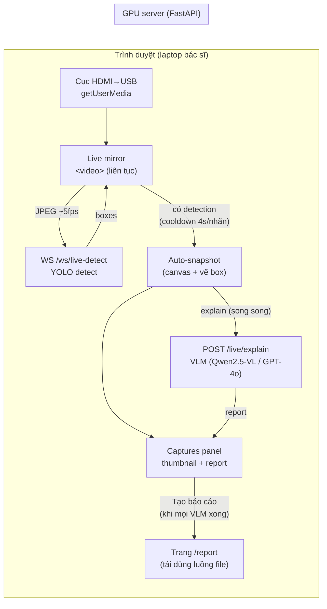
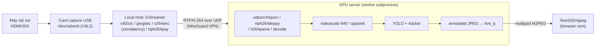

# Luồng Trực tuyến (Live Streaming) — Workflow chi tiết

> Tài liệu mô tả luồng nội soi **trực tuyến** của hệ thống để dựng slide báo cáo.
> Gồm: kiến trúc, workflow từng bước, data flow, GStreamer pipeline, schema dữ liệu,
> và lý do thiết kế.

---

## 1. Tổng quan — Hệ thống có 2 luồng live

| | **A. Networked tower capture** | **B. Browser-capture live** *(luồng chính bây giờ)* |
|---|---|---|
| Nguồn | Máy nội soi (HDMI/SDI) → card capture | Cục HDMI→USB cắm vào laptop bác sĩ |
| Xử lý ảnh | **GStreamer** trên GPU server | **Trình duyệt** (getUserMedia), không cần GStreamer |
| Detect chạy ở | Worker subprocess (GStreamer + YOLO) | YOLO ở main process backend (qua WebSocket) |
| Hiển thị | MJPEG annotated (`/live/{id}/mjpeg`) | `<video>` mirror local + overlay box |
| Setup | Cần GStreamer + VPN (RTP/UDP) | **Zero-setup** — chỉ cần cắm cục capture |
| Báo cáo | Theo phiên trên server | Auto-capture + VLM song song → 1 báo cáo |
| Dùng khi | Phòng mổ có hạ tầng streaming | Demo / phòng khám nhẹ / không triển khai pipeline |

→ Phần **B** là luồng tương tác mới (auto-capture + giải thích song song). Phần **A**
là luồng "thật" qua hạ tầng streaming. Slide nên trình bày B là chính, A để đối chiếu.

---

## 2. Luồng B — Browser-capture live (chi tiết)

### 2.1 Sơ đồ tổng quát



### 2.2 Workflow từng bước

1. **Bật nguồn** — `getUserMedia({video:{deviceId}})` lấy cục HDMI→USB (trình duyệt
   coi như webcam), gán vào `<video>`, mirror **chạy liên tục, KHÔNG dừng được**.
   - Có chỉnh **độ phân giải** (constraint), **object-fit** (contain/fill/cover),
     **zoom** để bù tín hiệu bị méo.
   - Notice nhắc đặt máy nguồn ở **Duplicate** (không Extend → méo/cắt hình).

2. **Bắt đầu AI** — mở WebSocket `/ws/live-detect/{id}`. Mỗi `200ms` (~5fps):
   grab khung hình → downscale `960px` → JPEG (q=0.6) → gửi **binary** qua WS.
   - **Back-pressure**: chỉ 1 frame "in-flight"; gửi frame kế tiếp **sau khi** nhận
     kết quả → GPU chậm không bị dồn hàng.

3. **Backend detect** — handler nhận bytes → `detect_jpeg()` chạy trong thread:
   `cv2` decode → **YOLO** inference → lọc theo ngưỡng từng lớp → chuẩn hoá bbox về
   canvas ảo **1920×1080** → lấy **top 10** box → trả JSON `{boxes:[…]}`.

4. **Overlay** — frontend vẽ box (màu theo nhãn + %) lên mirror theo % của 1920×1080
   (đúng ở mọi kích thước hiển thị).

5. **Auto-capture (điểm mới)** — mỗi khi có tổn thương (box conf cao nhất):
   - Chống spam: **cooldown 4s/nhãn**, tối đa **50 ảnh**.
   - Snapshot khung hình ra canvas (960px) **có vẽ box** → base64 → đẩy thẳng vào
     **panel bên phải**.
   - **Song song**: POST `/live/explain?label=&conf=` (body = JPEG) → **VLM** trả
     `LesionReport` có cấu trúc → điền vào card. Nhiều ảnh giải thích đồng thời,
     không chặn mirror/detection.

6. **Dừng phiên** — tắt AI + tắt mirror (stop tracks), giữ lại ảnh đã chụp.

7. **Tạo báo cáo** — nút bị **khoá + spinner** đến khi **mọi VLM xong** (không để
   tổn thương lọt vào báo cáo mà trống phân tích). Khi bấm:
   - Gom captures → 1 `Session` nguồn `live` (`saveLiveSession`) → chuyển state
     `EOS_SUMMARY` → workspace hiện **popup tổng hợp** → bấm "Xem báo cáo đầy đủ"
     mở `/report` (dùng lại y nguyên trang report/print/history của luồng file).

### 2.3 Data flow (định dạng dữ liệu)

| Chặng | Hướng | Nội dung |
|---|---|---|
| WS `/ws/live-detect` | browser → server | **JPEG binary** (960px, q0.6) |
| WS `/ws/live-detect` | server → browser | `{"boxes":[{"label","confidence","bbox":[x1,y1,x2,y2]}]}` — bbox theo **1920×1080**, tối đa 10 |
| POST `/live/explain` | browser → server | query `label,conf` + body **JPEG** (ảnh đã chụp) |
| POST `/live/explain` | server → browser | `{"report": LesionReport}` (cùng schema luồng file) |
| `saveLiveSession` | client | `Detection[]` `{label,confidence,bbox,timestamp,frame_b64,lesionReport,llmInsight,status}` |

### 2.4 Hằng số chính (frontend `browser-capture-live.tsx`)

```
SEND_INTERVAL_MS = 200    // ~5 fps gửi backend
GRAB_WIDTH       = 960    // downscale frame gửi detect
CAP_WIDTH        = 960    // ảnh snapshot lưu panel/report
CAPTURE_COOLDOWN_MS = 4000  // 4s/nhãn — chống spam
MAX_CAPTURES     = 50     // trần số ảnh/phiên
```

---

## 3. GStreamer pipeline (Luồng A — networked tower)

Browser-capture (B) **không** dùng GStreamer. Pipeline dưới đây thuộc luồng A —
máy nội soi xuất qua card capture, server giải mã + detect bằng GStreamer.

### 3.1 Sơ đồ



### 3.2 Pipeline string thực tế (worker)

```python
# Nguồn RTSP/RTP:
rtspsrc location="…" latency=200 ! rtph264depay ! h264parse ! <h264dec> ! queue ! videoscale(640) ! appsink

# Nguồn webcam/V4L2 (card capture):
v4l2src device="/dev/videoN" ! decodebin ! videoconvert ! queue ! videoscale(640) ! appsink
```

| Element | Vai trò |
|---|---|
| `v4l2src` / `rtspsrc` | Lấy nguồn từ card capture (V4L2) hoặc URL RTSP/RTP |
| `decodebin` / `rtph264depay ! h264parse ! avdec_h264` | Giải mã (codec-aware; `nvh264dec` nếu có GPU) |
| `videoconvert` | Chuẩn hoá pixel format → BGR cho detector |
| `videoscale` (640px) | Hạ kích thước trước inference (giảm tải) |
| `queue` (`max-size-buffers=4`) | Back-pressure, không buffer vô hạn |
| `appsink` (`sync=true,max-buffers=2,drop=true`) | Lấy frame mới nhất, bound latency ~2 frame |

### 3.3 Khác biệt khi `is_live = True`

- **Không pause-on-detection** (luồng file dừng khi phát hiện; live không dừng được)
  → overlay **tất cả** box lên feed và tiếp tục chạy.
- Đẩy JPEG annotated vào `live_q` (queue bounded `maxsize=2`, drop frame cũ).
- `/live/{id}/mjpeg` đọc `live_q` → stream `multipart/x-mixed-replace` cho browser.
- `_LIVE_EMIT_STEP = 2` (emit mỗi 2 frame ≈ 12–15fps), `_LIVE_BOX_TTL = 12`
  (box fade sau 12 frame nếu mất dấu), bỏ qua `SKIP_INITIAL_FRAMES`.

---

## 4. Pipeline detect (chung cho cả 2 luồng — YOLO stages)

Mỗi frame qua các bước (luồng A trong worker; luồng B rút gọn trong `detect_jpeg`):

1. **Viewport detection** — tìm vùng tròn ống soi (threshold → close 15×15 → contour
   lớn nhất; chấp nhận nếu ≥30% khung). Box ngoài vùng (panel thông tin BN) → bỏ.
2. **Frame-quality filter** — bỏ frame quá tối / near-black / std thấp (washed-out).
3. **YOLO inference** — FP32 mặc định; (luồng A: mỗi `FRAME_STEP=2` frame).
4. **Per-class thresholding** — ngưỡng riêng từng lớp (ung thư cao 0.75; viêm/loét 0.60).
5. **Tracking + dedup** (chỉ luồng A) — UTR-Track + OSNet-DCN ReID gán `track_id`;
   dedup 2 nhánh: tổn thương khu trú (1 lần/track) vs lan toả (cooldown theo vị trí).
6. **Chuẩn hoá bbox** về **1920×1080** (hằng dùng chung `FRAME_W/FRAME_H`).

> Luồng B (`detect_jpeg`) chạy bước 3–4 + chuẩn hoá; không tracking (live trình
> duyệt không cần dedup theo track), trả top 10 box mỗi frame.

---

## 5. Schema báo cáo VLM (`/live/explain` → LesionReport)

Cùng prompt + JSON schema với luồng file, nên báo cáo live **không phân biệt được**
với báo cáo từ video quay sẵn:

```jsonc
{
  "technique":   { "procedure", "device", "timestamp" },
  "description": { "size_mm", "paris_class", "surface",
                   "color", "margin", "vascular", "fluid" },
  "conclusion":  {
      "primary_dx",                  // VN (EN), song ngữ
      "severity",                    // thấp | trung bình | cao
      "differential": [ { "dx", "probability_pct" } ],  // 2–3, giảm dần
      "recommendations",
      "ai_confidence"                // 0–100
  }
}
```

- Model: `OPENAI_MODEL_VISION` (cloud) hoặc `OLLAMA_MODEL` (local, mặc định MedGemma-4B).
- `max_tokens=1500`, timeout `LLM_CALL_TIMEOUT_SEC` (90s), `detail:"high"`.

---

## 6. Lý do thiết kế (để giải thích trong slide)

| Quyết định | Lý do |
|---|---|
| **Browser-capture** không cần server pipeline | Zero-setup: laptop + cục capture là chạy, không cần GStreamer/VPN |
| **Mirror chạy liên tục, không pause** | Tín hiệu live không dừng được → đổi sang *capture-and-accumulate* thay vì pause-on-detection |
| **1 frame in-flight (back-pressure)** | GPU chậm không dồn hàng, latency thấp, không tràn bộ nhớ |
| **Auto-snapshot + cooldown 4s/nhãn** | Bắt mọi tổn thương nhưng không spam panel ở 5fps |
| **VLM giải thích song song** | Không chặn mirror/detection; nhiều report sinh đồng thời |
| **Khoá "Tạo báo cáo" đến khi VLM xong** | Không để tổn thương lọt vào báo cáo mà trống phân tích |
| **Gom vào Session `live` → dùng lại /report** | Tái dùng toàn bộ report/print/history; live = recorded về cấu trúc |
| **Notice Duplicate + display controls** | Extend → tín hiệu non-16:9 méo/cắt; cho chỉnh resolution/fit/zoom bù |
| **bbox chuẩn hoá 1920×1080 (1 hằng dùng chung)** | Overlay đúng ở mọi độ phân giải; đồng bộ frontend/DB/live-detect |

---

## 7. API endpoints liên quan

| Method | Path | Vai trò |
|---|---|---|
| WS | `/ws/live-detect/{id}` | Browser đẩy JPEG → nhận boxes (luồng B) |
| POST | `/live/explain` | 1 frame → LesionReport VLM (1 call/ảnh auto-capture) |
| GET | `/live/{id}/mjpeg` | Stream MJPEG annotated (luồng A) |
| POST | `/stream/connect` | Đăng ký nguồn live RTSP/V4L2 (luồng A) |

---

## 8. Cấu hình (env) liên quan

```
# Model / VLM
ENDOSCOPY_MODEL, ENDOSCOPY_REID, ENDOSCOPY_TRACKER
LLM_BACKEND=openai|ollama, OPENAI_MODEL_VISION, OLLAMA_MODEL, OLLAMA_BASE_URL
LLM_CALL_TIMEOUT_SEC=90

# Detect / dedup (luồng A)
ENDOSCOPY_CONF, CONF_*  (ngưỡng từng lớp), FRAME_STEP, ENDOSCOPY_SKIP_FRAMES
ENDOSCOPY_VIEWPORT_W, ENDOSCOPY_MAX_BBOX_RATIO, DEDUP_*

# Lưu trữ
ENDOSCOPY_DB_PATH, ENDOSCOPY_DB_BACKUP_DIR, ENDOSCOPY_DB_BACKUP_KEEP
```

---

## Phụ lục — Gợi ý chia slide

1. Slide 1: 2 luồng live (bảng mục 1) — "vì sao có 2"
2. Slide 2: Sơ đồ luồng B (mục 2.1) + workflow 7 bước
3. Slide 3: Data flow B (mục 2.3) — định dạng dữ liệu qua WS/HTTP
4. Slide 4: GStreamer pipeline A (mục 3.1 + 3.2)
5. Slide 5: Pipeline detect YOLO (mục 4)
6. Slide 6: Schema báo cáo VLM (mục 5)
7. Slide 7: Lý do thiết kế (mục 6) — phần "ghi điểm"
