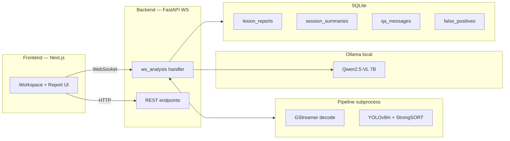
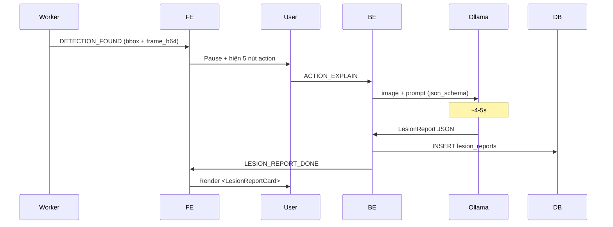
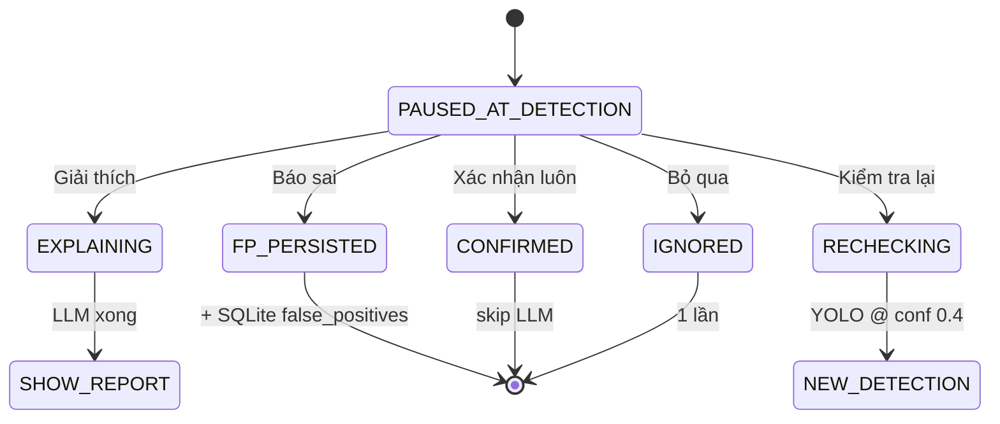
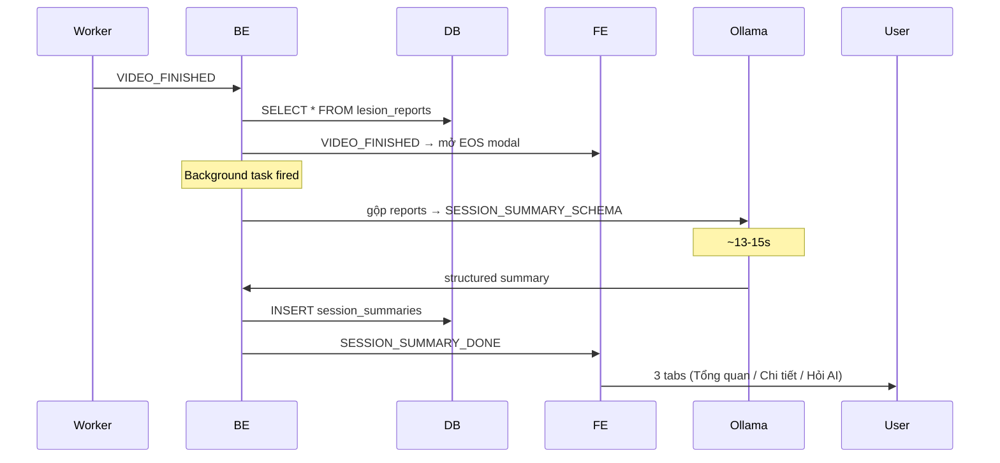
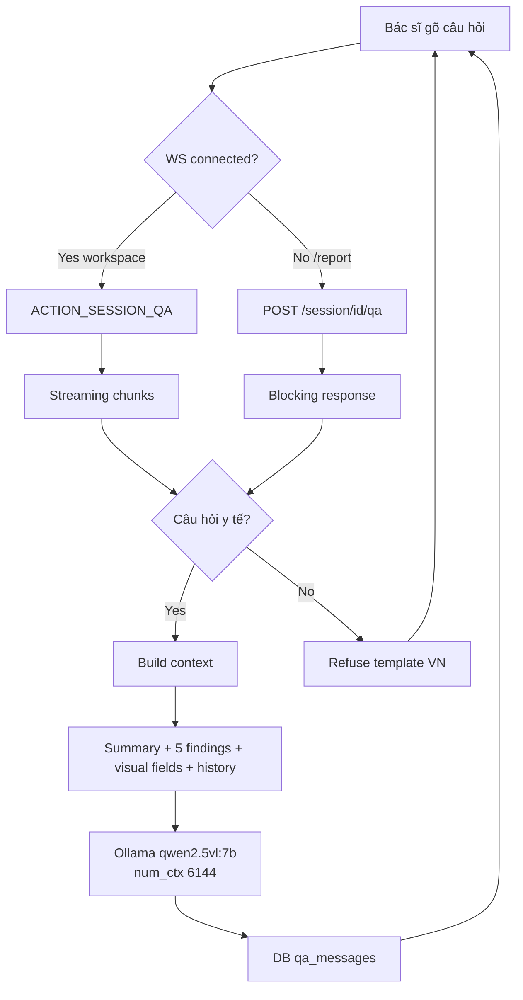
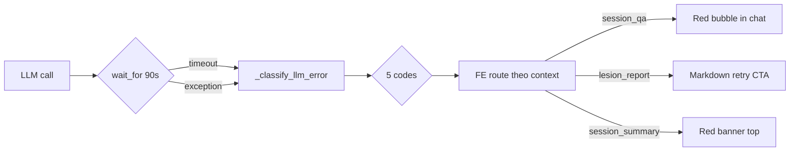
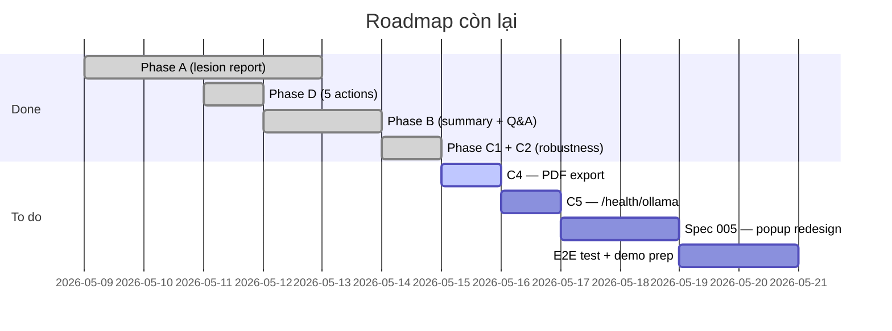

# AI Endoscopy Suite
## Báo cáo tiến độ đồ án

**Đề tài**: Hệ thống nội soi tiêu hóa hỗ trợ chẩn đoán bằng AI thời gian thực

- GVHD: *(tên thầy/cô)*
- Sinh viên: Nguyễn Anh Bùi
- 2026-05-14

> Detection thời gian thực (YOLOv8m + StrongSORT) +
> structured medical report + Q&A chatbot (Qwen2.5-VL 7B local)

---

## Tổng quan kiến trúc hệ thống



Stack: GStreamer · YOLOv8m · Qwen2.5-VL 7B · FastAPI · Next.js · SQLite

---

## Phase A — Per-detection structured report

**Luồng**: Detection → Pause → User bấm "Giải thích" → LLM phân tích ảnh → 3-section report



**Output schema** (3 sections):
- `technique` — phương pháp, thiết bị, thời điểm
- `description` — Paris class, size, surface, color, margin, vascular, fluid
- `conclusion` — primary_dx, severity (thấp/trung bình/cao), differential, recommendations, ai_confidence

---

## Phase A — Sample structured report

```json
{
  "technique": {
    "method": "Nội soi dạ dày-tá tràng AI-assisted",
    "device": "Olympus EG-760Z",
    "timestamp": "15 giây — frame #214"
  },
  "description": {
    "size_mm": "5-7 mm",
    "paris_class": "0-IIa+IIc",
    "surface": "gồ ghề, có fibrin",
    "color": "đỏ-trắng không đều",
    "margin": "không rõ", "vascular": "bị fibrin che", "fluid": "không thấy"
  },
  "conclusion": {
    "primary_dx": "Loét bờ fibrin (fibrin-margin ulcer)",
    "severity": "cao", "ai_confidence": 80,
    "differential": [
      {"dx": "Loét bờ fibrin", "probability_pct": 80},
      {"dx": "Adenocarcinoma dạ dày sớm", "probability_pct": 60}
    ],
    "recommendations": ["Sinh thiết bờ tổn thương", "Hội chẩn chuyên khoa"]
  }
}
```

**Verified**: 20+ reports thật · schema validation 100% pass · latency 4.3-4.6s

---

## Phase D — 5 doctor actions



| Action | Persist DB? | Latency |
|---|---|---|
| Giải thích | ✅ lesion_reports | ~5s |
| Xác nhận luôn | — | tức thì |
| Kiểm tra lại | — | ~2s YOLO re-run |
| **Báo sai** | ✅ **false_positives** (cross-session auto-skip IoU>0.6) | tức thì |
| Bỏ qua | — | tức thì |

---

## Phase B — Session summary + Q&A chatbot

**Luồng tổng hợp tự động khi video kết thúc**:



**Summary có 5 phần**: overview · priority_findings (top-5) · patterns · checklist (4 categories) · overall_risk

---

## Phase B — Q&A architecture



**Scope filter**: 5 case test ✅ (in-scope · off-topic · jailbreak)
**Reconnect**: WS đóng + mở lại → BE replay summary + qa history

---

## Phase C — Robustness layer

**C1 — Error handling**:



5 error codes: `LLM_TIMEOUT` · `LLM_UNAVAILABLE` · `LLM_CRASHED` · `LLM_BAD_JSON` · `LLM_ERROR`

**C2 — Loading skeletons**: lesion report card (hero + 3 sections) · session summary panel (badge + counts + 3 priorities) — shimmer animation thay vì spinner đơn

---

## Metrics & test results

| Metric | Phase A | Phase B summary | Phase B Q&A | Phase D FP |
|---|---|---|---|---|
| Latency P50 | 4.5s | 13.6s | 2.7s | tức thì |
| Latency P90 | 4.8s | 18s | 5s | — |
| Verified runs | 20+ | 4 | 6+ | 3 |
| Schema pass | 100% | 100% | N/A | — |

**Prompt verification** (post-tune):
- Method/timestamp đúng format VN: **100%**
- Recommendations no leak: **100%**
- Primary↔differential consistent: **100%** (backend post-process)
- Bilingual VN+EN: **66%** — chấp nhận với 7B model
- Scope filter (in-scope/off-topic/jailbreak): **5/5 pass**

**Tài nguyên**: RTX 4080 SUPER 16GB · VRAM 14GB / 16GB · Disk 600GB free

---

## Lộ trình còn lại



**Open PRs**: #22 spec popup · #23 Phase D · #24 Phase B+C — chờ merge

**Risks**: bilingual 66% (giới hạn 7B) · cần dataset thật để verify diff models

---

## Demo flow cho hôm thuyết trình

1. Upload video nội soi → AI detect realtime
2. Pause at detection → bấm 5 nút (Giải thích / Xác nhận luôn / Kiểm tra lại / Báo sai / Bỏ qua)
3. "Giải thích" → Card 3 section hiện ra (skeleton trong khi chờ)
4. Tiếp tục video → 2-3 detection
5. Video kết thúc → modal danh sách detection
6. Vào /report → click session → tab "Tổng hợp AI"
7. Đọc Overview / Chi tiết → bấm "Hỏi AI"
8. Hỏi: *"Tổn thương nguy hiểm nhất?"* → AI trả lời streaming
9. Hỏi off-topic: *"Thời tiết hôm nay?"* → AI refuse
10. (Sau C4) Bấm "Xuất PDF" → tải báo cáo đầy đủ

**Cảm ơn — câu hỏi?**
